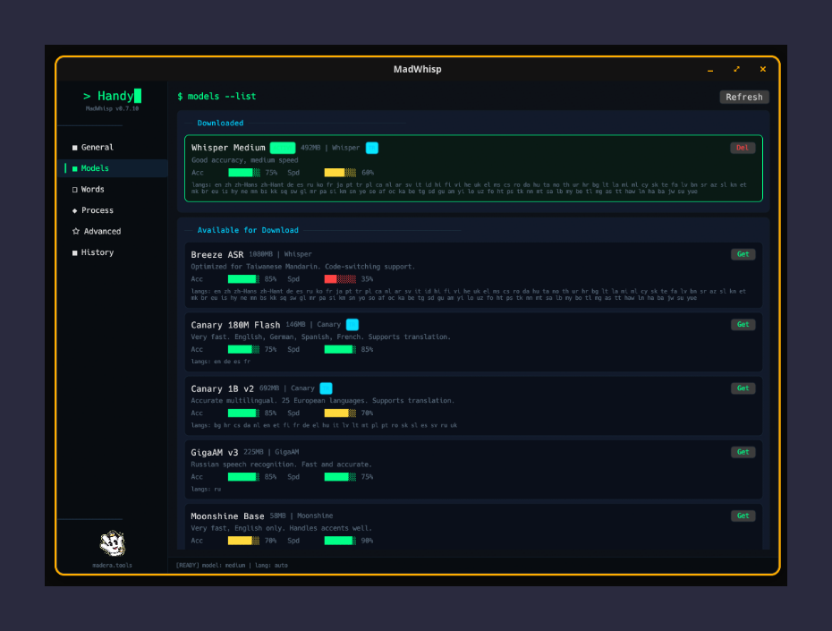
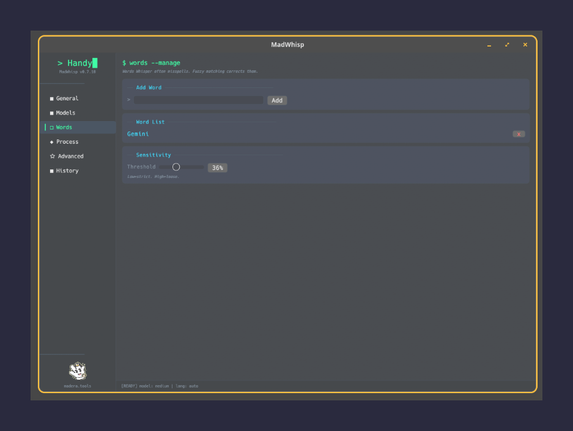

<p align="center">
  
</p>

<h1 align="center">MotsDits</h1>

<p align="center">
  <strong>Speech-to-text that runs on your machine. Not in the cloud. Not behind a paywall.</strong>
</p>

<p align="center">
  <a href="https://github.com/mussonking/motsdits-app/releases/latest"></a>
  <a href="https://github.com/mussonking/motsdits-app/blob/main/LICENSE"></a>
  <a href="https://github.com/mussonking/motsdits-app/stargazers"></a>
</p>

<p align="center">
  <sub>A <a href="https://madera.tools">madera.tools</a> project — forked from <a href="https://github.com/cjpais/Handy">Handy</a> with a native Linux UI and advanced word correction</sub>
</p>

---

<p align="center">
  
</p>

<p align="center">
  
</p>

---

## What is MotsDits?

Press a shortcut. Speak. Your words appear wherever your cursor is.

MotsDits is a desktop speech-to-text app powered by [Whisper](https://github.com/openai/whisper) that runs **100% locally** — your voice never leaves your machine. It's built for people who want fast, private transcription without subscriptions or cloud dependencies.

### How it works

```
🎙️  You speak        →  Audio captured via your mic
🔇  Silence filtered  →  Silero VAD removes dead air
🧠  Transcribed       →  Whisper / Parakeet / Canary (on your GPU or CPU)
📋  Pasted            →  Text appears in your active app
```

## Why MotsDits?

|                       |                                                                                           |
| --------------------- | ----------------------------------------------------------------------------------------- |
| **Offline**           | Everything runs on your hardware. No internet required. No data sent anywhere.            |
| **Fast**              | GPU-accelerated transcription. Sub-second on modern GPUs.                                 |
| **Smart corrections** | Per-word aliases and blacklists fix what Whisper always gets wrong.                       |
| **Native Linux UI**   | No Electron. No WebView. Pure native interface via [egui](https://github.com/emilk/egui). |
| **Multi-model**       | Choose from Whisper, Parakeet, Canary, Moonshine — download and switch in one click.      |
| **Extensible**        | Post-processing via any OpenAI-compatible API. Custom scripts. Your rules.                |

## Install

### Download (recommended)

Grab the latest release for your system:

| Platform                       | Download                                                              |
| ------------------------------ | --------------------------------------------------------------------- |
| **Ubuntu / Debian / Pop!\_OS** | [`.deb`](https://github.com/mussonking/motsdits-app/releases/latest)      |
| **Fedora / RHEL**              | [`.rpm`](https://github.com/mussonking/motsdits-app/releases/latest)      |
| **Any Linux**                  | [`.AppImage`](https://github.com/mussonking/motsdits-app/releases/latest) |

### Build from source

```bash
# Prerequisites: Rust (rustup.rs) + Bun (bun.sh)
git clone https://github.com/mussonking/motsdits-app.git
cd MotsDits
./install.sh    # auto-detects your distro, installs deps, builds, configures shortcuts
```

The installer handles everything:

- Detects your package manager (apt, dnf, pacman, zypper)
- Installs runtime dependencies (wtype, wl-clipboard, etc.)
- Detects your desktop (COSMIC, GNOME, KDE, Hyprland, Sway) and configures shortcuts
- Warns about NVIDIA-specific env vars if needed

## Smart Word Correction

Whisper is great, but it consistently botches certain words. MotsDits fixes this with a **per-word correction system**:

### Fuzzy matching

Add words to your list and MotsDits auto-corrects similar-sounding transcription errors using Levenshtein distance + Soundex phonetic matching.

### Hard aliases

Whisper always writes "Jiminy" when you say "Gemini"? Add an alias:

```
Word: Gemini
Alias: Jiminy  →  always becomes "Gemini", no fuzzy needed
```

### Blacklist

The fuzzy matcher turns "feature" into "FOOTER"? Blacklist it:

```
Word: FOOTER
Blacklist: feature  →  "feature" is never touched
```

All configured per-word in the UI. No regex. No config files.

## Keyboard Shortcuts

MotsDits uses your desktop's native shortcut system:

| Shortcut           | Action                          |
| ------------------ | ------------------------------- |
| `Ctrl+Space`       | Start/stop transcription        |
| `Ctrl+Shift+Space` | Transcribe with post-processing |

Or trigger from the command line:

```bash
motsdits-ctl transcribe       # start/stop recording
motsdits-ctl post-process     # with AI post-processing
motsdits-ctl cancel           # cancel current operation
```

## Supported Models

| Model                           | Engine      | Best for                        |
| ------------------------------- | ----------- | ------------------------------- |
| Whisper (tiny → large-v3-turbo) | Whisper.cpp | General purpose, many languages |
| Parakeet                        | NVIDIA NeMo | English, high accuracy          |
| Canary                          | NVIDIA NeMo | Multilingual, fast              |
| Moonshine                       | ONNX        | Lightweight, CPU-friendly       |

Download models directly from the app — one click.

## Post-Processing

Optionally pipe transcriptions through any OpenAI-compatible API for:

- Grammar correction
- Translation
- Summarization
- Custom prompts

Works with local LLMs (Ollama, LM Studio) or cloud APIs.

## Architecture

```
┌──────────────┐    ┌─────────┐    ┌───────────────┐    ┌──────────┐
│  Microphone  │───▶│   VAD   │───▶│   Whisper /    │───▶│  Paste   │
│   (CPAL)     │    │ (Silero)│    │   Parakeet     │    │ (wtype)  │
└──────────────┘    └─────────┘    └───────────────┘    └──────────┘
                                          │
                                   ┌──────▼──────┐
                                   │    Word     │
                                   │ Correction  │
                                   └─────────────┘
```

- **Backend**: Rust + [Tauri 2.x](https://tauri.app/)
- **UI**: Native [egui](https://github.com/emilk/egui) on Linux (no WebView)
- **Audio**: CPAL → PipeWire/ALSA
- **Paste**: wtype (Wayland) / xdotool (X11) with smart fallback chain

## NVIDIA Users

If the app crashes on startup with an NVIDIA GPU:

```bash
WEBKIT_DISABLE_DMABUF_RENDERER=1 \
WEBKIT_DISABLE_COMPOSITING_MODE=1 \
JavaScriptCoreUseJIT=0 \
motsdits
```

The installer detects NVIDIA and warns you automatically.

## Contributing

MotsDits is a fork of [Handy](https://github.com/cjpais/Handy) by [@cjpais](https://github.com/cjpais). We maintain upstream compatibility — contributions that improve the Linux experience are welcome.

```bash
# Dev setup
bun install
bun run tauri dev -- -- --debug
```

## License

MIT — see [LICENSE](LICENSE) for details.

---

<p align="center">
  <sub>Built with obsession by <a href="https://madera.tools">madera.tools</a></sub>
</p>
